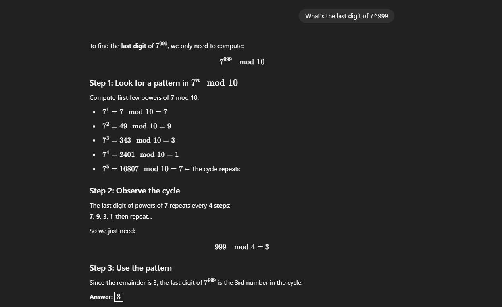

# Modou Jaw 

If you’ve spent any time in AI or machine learning, you’ll notice something funny—people keep using big words that sound important, but no one seems to agree on what they actually mean. One of those words is **"reasoning."** It’s like the word keeps slipping away just when you think you’ve caught it. Someone writes a paper and says, “This is reasoning,” but then someone else comes along and says, “No, that’s not reasoning—this is!”

Let’s stop and really look at what’s going on.

Suppose you ask a machine:  
**"What’s the capital of Comoros?"**  
That’s not reasoning. That’s recall. It’s like opening a drawer labeled “France” and finding the word “Paris” inside. No steps, no thinking—it just *knows* (or doesn’t).

But now ask:  
**"If a car is going 60 miles an hour and travels for 3 hours, how far does it go?"**  
Now something *interesting* happens. The machine has to understand a relationship—it has to know that distance equals speed x time. It’s not just pulling a fact out of a drawer anymore. It has to *do* something. It has to take a few steps, like this:

1. What does the question want? Distance.  
2. What do I have? Speed and time.  
3. What connects them? Oh! Distance = Speed × Time.  
4. So, 60 × 3 = 180.

**That** is reasoning. It’s when you take pieces of knowledge and link them together to figure something out you didn’t know directly.

So when we say “reasoning models,” we should mean models that can do this kind of multi-step thinking—where they don’t just *retrieve* an answer but *build* it step by step.

But until we all agree on what “reasoning” really means, we’ll keep seeing new definitions in every new paper. That’s science—it’s messy, and that’s part of the fun.

Most modern LLMs are capable of basic reasoning and can answer questions like, "If a car is moving at 60 mph and travels for 3 hours, how far does it go?" So, today, when we refer to reasoning models, we typically mean LLMs that excel at more complex reasoning tasks, such as solving puzzles, riddles, and mathematical proofs.

Additionally, most LLMs branded as reasoning models today include a **"thought"** or **"thinking"** process as part of their response. Whether and how an LLM actually "thinks" is a separate discussion.

Intermediate steps in reasoning models can appear in two ways. First, they may be explicitly included in the response, as shown in the previous example. Second, some reasoning LLMs, such as OpenAI's o1, run multiple iterations with intermediate steps that are not shown to the user.

  "Reasoning" is used at two different levels: 1) processing the input and generating via multiple intermediate steps and 2) providing some sort of reasoning as part of the response to the user.

### When Do We Need a Reasoning Model?

Reasoning models are designed to excel at **complex tasks** such as:

- Solving puzzles  
- Advanced math problems  
- Challenging coding tasks  

However, they are **not necessary** for simpler tasks like:

- Summarization  
- Translation  
- Knowledge-based question answering  

In fact, using reasoning models for everything can be **inefficient and expensive**. For instance:

- Reasoning models are typically **more expensive** to use  
- They tend to be **more verbose**  
- They are sometimes **more prone to errors** due to *"overthinking"*

As with any tool, the simple rule applies:

> **Use the right tool (or type of LLM) for the task.**

---

### Strengths and Limitations of Reasoning Models

| Good at                                                  | Bad at                                |
|----------------------------------------------------------|----------------------------------------|
| Deductive or inductive reasoning (e.g.,riddles, math proofs)   | Fast and cheap responses(more inference time)              |
| Chain-of-thought reasoning (breaking down multi-step problems)  | Knowledge-based tasks(hallucination)                  |
| Complex decision-making tasks                           | Simple tasks("overthinking")                           |
| Better generalization to novel problems
